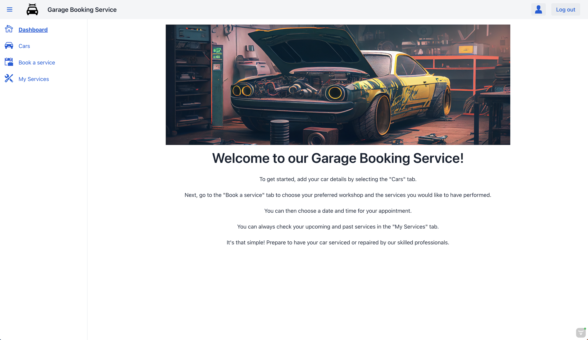
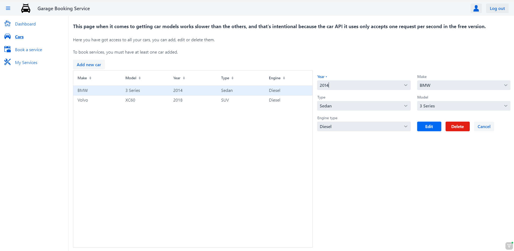
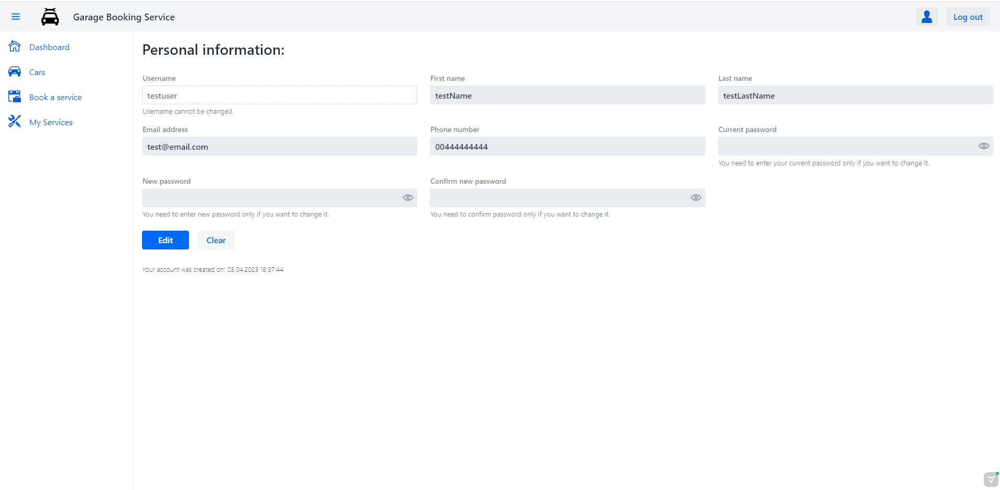

# CAR SERVICE GARAGE

## 1. Description

Car Service Garage is an intuitive **RESTful** application that allows users to book appointments for car repairs or services at various automotive workshops located in different cities. Users can easily select the workshop of their choice and the specific service they want to have performed on their car. The application offers a convenient way to browse the history of reserved services and make changes to existing reservations. The frontend version of the application provides all necessary views, to show capabilities of the backend.

## 2. Here is only frontend, link to backend

This repository contains only the frontend of Car Service Garage. To function properly, it must be run in conjunction with the backend version, which can be found here: [**GitHub**](https://github.com/viepovsky/Car-Service-Garage-Backend).

## 3. Vaadin

I used Vaadin to create the frontend, and while the design is not very good-looking, it effectively shows the backend's functionalities. Additionally, the application is fully responsive and can be accessed on any device. Click to see actual application views: [**Application views**](https://github.com/viepovsky/Car-Service-Garage-Frontend#8-application-views)

## 4. Usage of external API

At the moment, the application is using two external API: 

- Car API to provide car details such as the year, make, model, and type.
- Weather API to retrieve a 13-day forecast for the garage location.

Car API is used to retrieve car details when user adds or edits their car. The weather API is used during booking, to show the weather near selected workshop on the selected date. 

## 5. How to run

To run whole application, you need to first run the backend by running `AppBackendApplication` class. Once that is done, to run the frontend, simply type `mvnw` (Windows) or `./mvnw` (Mac & Linux) in terminal IDE. Then, if the browser does not open automatically, you can access the application by opening http://localhost:8081 in your browser.

In case of problems on Mac with the error message `zsh: permission denied: ./mvnw`, simply type `chmod +x ./mvnw` in terminal IDE to make the file executable, and then type `./mvnw` again to start the application.

## 6. Logging to site, initial data

The backend of Car Service Garage contains initial data to demonstrate the application's capabilities. After testing with the provided user account, you can add your own to test the application with your own data. Please note that the data is being reset after each backend application run.

To log in as provided user, use the username: `testuser` and the password: `testpassword`

## 7. Future plans for the application

Next, I will develop an ADMIN view for the application, which will allow administrators to add new garage locations and update the current status of customer cars during repairs and services.
In addition, the view will enable administrators to manage customer accounts and their associated cars, allowing them to make changes at the customer's request.

## 8. Application views:

### Login View

### Register View

### Dashboard View

### Cars View

### Book View

### Services View

### User View

